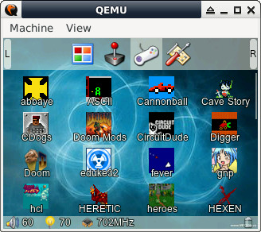

# Linux Kernel 4.14.0 for FC3000 Handheld (QEMU)
## Description
The default configuration file is arch/arm/configs/suniv-qemu_defconfig.  
  
## How to setup toolchain
```console
$ cd
$ wget https://github.com/steward-fu/miyoo/releases/download/v1.0/toolchain.7z
$ 7za x toolchain.7z
$ sudo mv miyoo /opt
```
  
## How to build kernel
```console
$ ARCH=arm make suniv-qemu_defconfig
$ ./tools/make_suniv.sh
```
  
## How to run QEMU for FC3000 handheld
```
$ cd
$ wget https://github.com/steward-fu/fc3000/releases/download/v1.0/fc3000-qemu_20220929.7z
$ 7za x fc3000-qemu_20220929.7z
$ ./run.sh
```

  
## How to extract rootfs.img
```
$ zcat rootfs.img | cpio -idvm
```
  
## How to repack rootfs.img
```
$ sudo find . | sudo cpio -o -H newc | gzip -9 > ../rootfs.img
```
